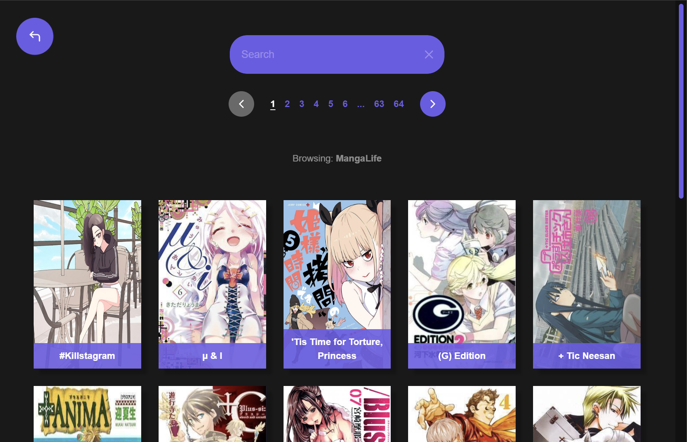
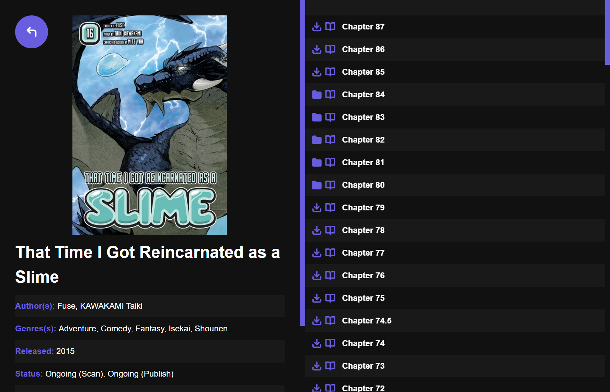
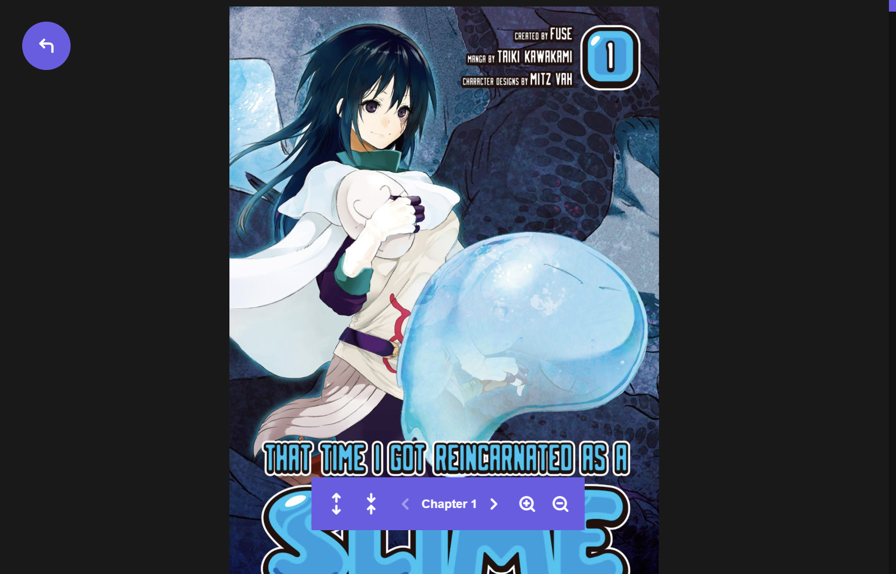

<div align="center">
  
  <p></p>
  <h1><b>Manga Puppet</b></h1>
  <h3>Sleek manga downloader & reader for Windows, MacOS, and Linux</h3>
  <p></p>
  <a>
    
  </a>
  <br />
</div>
<br />

## **Table of Contents**

[Download](#download)  
[Screenshots](#screenshots)  
[Why?](#why)  
[Sources](#sources)  
[Development](#development)  
[Built With](#built-with)  
[Contributing](#contributing)  
[License](#license)

## **Download**

&rarr; Coming soon

## **Screenshots**





## **Why?**

Manga Puppet aims to be a sleek, accessible, and user-friendly manga downloading and reading option by providing a richer visual experience (cover images, manga information, etc.) as well as a cleaner and easier-to-navigate interface.

## **Sources**

As of now, only **MangaLife** has been implemented. More coming though!

## **Development**

Clone the repository

```bash
git clone https://github.com/lijandrew/manga-puppet.git
```

Navigate to the cloned directory

```bash
cd manga-puppet
```

Install dependencies

```bash
npm i
```

Start development app  
_Note: live reload is only for the React frontend. Electron requires manual relaunching._

```bash
npm run dev
```

## **Built With**

- [Electron](https://www.electronjs.org/)
- [React](https://reactjs.org/)
- [Puppeteer](https://github.com/puppeteer/puppeteer)
- [Axios](https://axios-http.com/)
- [JSDOM](https://github.com/jsdom/jsdom)
- [JSZip](https://stuk.github.io/jszip/)

## **Contributing**

PRs are appreciated!

## **License**

MIT
